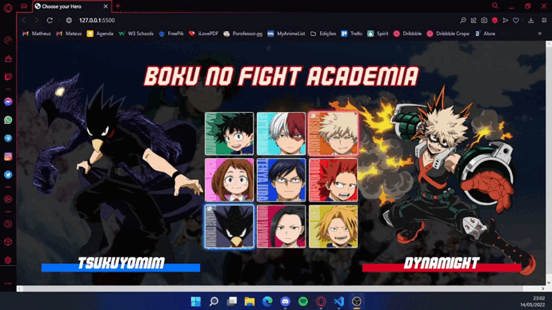

# Character Select 

## Sobre o projeto:

Esse projeto foi desenvolvido durante a Semana DEV em Dobro, com auxílio dos desenvolvedores do canal Dev em Dobro. 

O objetivo do projeto era realizar uma interface de seleção de personagem similar aos vídeo-games de luta antigos (como Mortal Kombat, Street Fighter, entre outros), no qual é possível escolher um personagem passando o cursor por cima do mesmo, fazendo com que o personagem que está com o cursor em cima seja exibido na lateral esquerda ou direta, dependendo do jogador que está selecionando (nesse caso foi simulado apenas o lado esquerdo, o direito já está automaticamente selecionado pelo computador).  

## Layout original do projeto:

*Diferente da dupla Dev em Dobro que utilizou personagens da MARVEL, para este projeto eu utilizei personagens do anime Boku no Hero Academia.*

## Linguagens utilizadas:

* HTML5
* CSS3
* JavaScript

## Autor:

*Mateus Cantanhêde da Cruz*
Instagram: *@mateuzaum*
